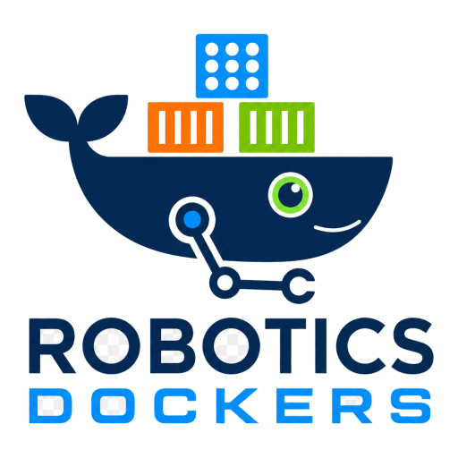

# robotics-dockers

<p align="center">
  
</p>

`robotics-dockers` generates Docker build contexts for ROS 2 development. Each generated image contains one development account whose user ID and primary group ID are chosen at build time.

This design is deliberately simple at runtime: the container starts directly as the configured development user. It does not start as root, rewrite account files, traverse the home directory or change file ownership when the container starts.

## Why the numeric identity is fixed during the build

Linux stores file owners as numeric UIDs and GIDs. User and group names are only labels. A process running as UID 1001 inside a container creates UID-1001 files on a bind mount, even if the host calls its own UID-1001 account by another name.

Choose the same UID and primary GID that own the host workspace:

```bash
id --user
id --group
```

The generated image then creates files on `/workspace` with the correct host ownership without runtime account adaptation.

This release intentionally breaks the former runtime-remapping contract. Old generated contexts must be regenerated. Unknown accounts inherited from a base image are never renamed or deleted automatically; resolve a known collision with an explicit preparation hook or edit the generated Dockerfile.

## Install

Requirements:

- Python 3.10 or newer;
- Docker Engine with BuildKit;
- Docker Compose v2 for the generated Compose file.

Install the project in a virtual environment:

```bash
git clone https://github.com/jfrascon/robotics_dockers.git
cd robotics_dockers
python3 -m venv .venv
source .venv/bin/activate
python -m pip install .
```

For repository development:

```bash
python -m pip install -e '.[dev]'
```

[`scripts/install_docker.sh`](scripts/install_docker.sh) can install Docker from Docker's official Ubuntu repository. Docker group membership grants root-equivalent control over the host Docker daemon; use it only on a trusted development machine.

## Generate an image project

Required fields are positional, ordered from the local development identity to the generated image target:

```bash
robotics-dockers new developer 1000 1000 jazzy local/robotics-jazzy:latest \
    --group robotics \
    --output ./docker-jazzy
```

The positional order is `user-name user-id group-id ros-distro img-id`. If `--group` is omitted, it defaults to `user-name`:

```bash
robotics-dockers new developer "$(id --user)" "$(id --group)" jazzy local/robotics-jazzy:latest \
    --output ./docker-jazzy
```

UID and GID must contain decimal digits and resolve to a value from 1000 through 4294967294. Leading zeroes are accepted by the generator and stored in canonical decimal form. User and group names use a deliberately narrow local-account format: lowercase letters, digits, `_` and `-`, with a lowercase letter or `_` first and at most 32 characters.

The selected output directory must be absent or empty. Generation refuses existing content before writing anything so rerunning the command cannot silently destroy edited resources.

Useful generation options:

| Option | Meaning |
| --- | --- |
| `--base-img IMAGE` | Select another base image instead of the Ubuntu version associated with the ROS distro. |
| `--nvidia` | Use the host NVIDIA driver instead of installing Mesa in the image. |
| `--meta-title TEXT` | Set the OCI image title in the generated Dockerfile. |
| `--meta-desc TEXT` | Set the OCI image description. |
| `--meta-authors TEXT` | Set the OCI image authors. |
| `--output PATH` | Select the generated directory. A temporary directory is used when omitted. |

The output contains:

```text
docker-jazzy/
├── Dockerfile
├── Dockerfile.update-user
├── build.py
├── docker-compose-dev.yaml
└── .resources/
    ├── user_preparation.d/
    ├── extra.d/
    ├── configure_image_user.sh
    ├── entrypoint_user.sh
    └── ...
```

## Build

Review `.resources/` and then run:

```bash
cd docker-jazzy
python3 build.py
```

`build.py` reuses Docker's BuildKit cache by default. Its options are:

- `--pull`: ask Docker to check for a newer base image;
- `--no-cache`: rebuild every Dockerfile step;
- `--pkgs-dir PATH`: when the generator did not fix a ROS package path, mount this source directory for `rosdep` dependency discovery.

The generated Dockerfile keeps stable system and ROS installation phases before editable project phases. Each phase receives only the resources it consumes through `RUN --mount=type=bind`. BuildKit includes mounted file metadata in the cache decision but does not copy those resources into the layer. No project-specific checksum is needed. See [Docker build cache invalidation](https://docs.docker.com/build/cache/invalidation/).

The base-system phase intentionally runs `apt-get dist-upgrade`. Each requested package set is passed to one real apt invocation. A separate simulation would repeat apt's dependency resolution without making the real installation transactional. If apt fails, Docker rejects the incomplete build layer.

The generated Dockerfile owns the static OCI title, description and authors. `build.py` adds only `org.opencontainers.image.created`, because that timestamp belongs to the actual build.

## Development identity

The image exposes the identity through these environment variables:

```text
ROBOTICS_DOCKERS_USER
ROBOTICS_DOCKERS_USER_ID
ROBOTICS_DOCKERS_USER_HOME
ROBOTICS_DOCKERS_USER_PRIMARY_GROUP
ROBOTICS_DOCKERS_USER_PRIMARY_GROUP_ID
```

Equivalent `io.github.jfrascon.robotics-dockers.user.*` labels make the numeric and textual identity inspectable without starting a container.

During the build, `configure_image_user.sh` accepts these states:

- neither requested name exists, so the exact group and user can be created;
- the exact primary group exists but the user does not, so the group can be reused and the user created;
- the exact group and user already exist with the requested names, UID, GID, real `/home/<user>` directory and `/bin/bash` shell, so both can be reused.

An existing user without its exact primary group is an incomplete identity and is rejected rather than repaired implicitly.

Every relevant name, ID and home collision in `/etc/passwd` and `/etc/group` is checked before the first account change. A conflicting base-image account causes the build to fail with no automatic repair. `shadow-utils` remains responsible for validating and updating the protected account records.

The password is locked. When a local `dialout` or `video` group exists, the development user is added to that supplementary group. Known XDG, local-tool and ROS directories are created with mode `0755`; existing real directories keep their mode and only the directory itself receives the configured owner. Files and symbolic links at those paths, including paths copied from `/etc/skel`, are rejected before account creation. The account is not added to the `sudo` group. At the end of the build, a named `/etc/sudoers.d/robotics-dockers-<user>` rule grants `NOPASSWD` access and is validated with `visudo`. This keeps the project policy separate from Ubuntu's password-based `sudo` group policy.

### Base images containing `ubuntu:1000:1000`

Ubuntu 24.04 contains a pre-created `ubuntu` account in some image variants. Generated contexts include two disabled examples:

```text
.resources/user_preparation.d/
├── 01-delete-ubuntu-user.sh.example
└── 02-reuse-ubuntu-user.sh.example
```

- `01-delete-ubuntu-user.sh.example` requires unique local passwd/group records, the expected home, the exact blocking UID/GID, no other primary users of the group and no owned files outside the home or mailbox before deleting the account, group and home.
- `02-reuse-ubuntu-user.sh.example` requires the expected public `ubuntu:1000:1000` identity, home and shell, then renames the account and group and moves the home while preserving its content. The following identity configuration step verifies the result.

Read the chosen example, then remove only its `.example` suffix to activate it:

```bash
mv .resources/user_preparation.d/02-reuse-ubuntu-user.sh.example \
   .resources/user_preparation.d/02-reuse-ubuntu-user.sh
```

Only regular `*.sh` files run. Symbolic links are rejected. Hooks run through Bash in bytewise `LC_ALL=C` filename order. Prefix custom hooks with `01-`, `10-`, `20-` and so on when order matters. Files ending in `.example` never execute.

Preparation hooks run as root and may change the image. They are an explicit mechanism for base-image state understood by the image author, not a general collision-repair framework.

## Editable extras

### Apt

```text
.resources/extra.d/apt/
├── keyrings.d/*.asc|*.gpg
├── sources.d/*.sources
└── packages.txt
```

Use standard apt formats:

- store armored or binary repository keys in `keyrings.d`;
- store deb822 repository definitions in `sources.d`;
- put one apt package specification per active line in `packages.txt`; blank lines and `#` comments are allowed.

Only regular files immediately inside `keyrings.d` and `sources.d` are accepted; nested directories, symbolic links and unsupported extensions are rejected. Apt options disguised as package lines and attempts to overwrite inherited files under `/etc/apt/keyrings` or `/etc/apt/sources.list.d` are also rejected. Each destination is checked immediately before its copy. If a later collision is found, Docker discards the entire failed build layer. `apt-get update` validates deb822 syntax and repository signatures, and the complete package list is passed to one installation request.

### Python

```text
.resources/extra.d/python/
├── requirements.txt
└── install.d/*.sh
```

The editable requirements file initially contains:

```text
argcomplete
ruff
cmake-format
pre-commit
jinja2
python-rapidjson
uv
```

These packages are installed with the image's `/usr/bin/python3`, `pip --user` and `PYTHONUSERBASE=$HOME/.local`. Console commands therefore go to `$HOME/.local/bin`. `requirements.txt` follows pip's standard requirements-file syntax and normally resolves packages from the indexes configured for pip, PyPI by default.

Regular `install.d/*.sh` hooks run afterwards as the real development user in `LC_ALL=C` filename order. They can install a user-local Python version, create a virtual environment or perform another Python-specific setup. Put that setup and its dependencies in the same hook rather than inventing additional project file formats.

The project's `NOPASSWD` sudo rule is installed only after Python and Rust hooks finish. A base image may already provide other privilege policies, so this ordering is a maintainability guard, not a security boundary against a hostile Dockerfile author.

### Rust

```text
.resources/extra.d/rust/install.sh.example
```

The project does not choose whether to install Rust, which toolchain becomes the default, which applications are installed or whether moving channels such as `stable` are acceptable. Only a file named exactly `install.sh` is active.

The example explains an important base-image conflict: `/usr/bin/rustc` and `/usr/bin/cargo` may exist without rustup. Installing rustup would add another pair under `$HOME/.cargo/bin`, and the user environment would give that pair priority. The example stops and asks the image author to make that choice explicitly. Read and edit it before renaming it to `install.sh`.

### Environment hooks

```text
.resources/extra.d/env.d/*.rc
```

The build installs regular `*.rc` files into `$HOME/.env.d`. At runtime, `$HOME/.env.rc`:

1. creates the user XDG directories under the home;
2. adds `$HOME/.local/bin` to `PATH` without duplication;
3. adds `$HOME/.cargo/bin` when it exists;
4. loads `$HOME/.ros.rc`;
5. sources regular `$HOME/.env.d/*.rc` files in `LC_ALL=C` filename order.

The user controls these hooks. Activating a Python virtual environment there is allowed, but can change which Python ROS tools use; the project does not activate a virtual environment by default. The environment-loaded marker is set only after every hook succeeds, so a failed hook can be fixed and retried with `reload_envrc`.

## Runtime contract

The generated image ends with:

```dockerfile
USER "${ROBOTICS_DOCKERS_USER}"
WORKDIR "${ROBOTICS_DOCKERS_USER_HOME}"
ENTRYPOINT ["/usr/local/bin/entrypoint.sh"]
CMD ["bash"]
```

The root-owned entrypoint does not require root privileges. It reads the executing UID and primary GID:

- when both equal the identity stored in the image, it exports `HOME`, `USER`, `LOGNAME` and `SHELL` from the build metadata, validates optional XDG and NVIDIA state, loads `.env.rc`, and executes the requested command;
- when either differs, it executes the requested command directly without loading the development environment.

Supplementary groups do not change this decision. Compose `group_add` can therefore grant access to `renderD*` while the normal environment still loads.

For the development identity, startup messages go to stdout/stderr and to:

```text
$HOME/.local/state/robotics-dockers/entrypoint.log
```

### Docker overrides

Docker settings are independent, and the following behavior is intentional:

- `docker run --user root IMAGE COMMAND` keeps the project entrypoint, but root's UID/GID do not match and the command runs directly without the development environment.
- `docker run --user USER:GROUP ...` may replace the primary GID. If either numeric value differs from the built identity, the environment is not loaded.
- `docker run --group-add GID ...` adds a supplementary group only and does not disable the environment.
- `docker run --workdir PATH ...` changes only the initial working directory. It does not change `HOME` or the identity decision.
- `docker run --entrypoint ...` bypasses the project entrypoint completely. The replacement is responsible for any environment loading it needs.
- `docker exec` starts an additional process in an existing container and does not run the image entrypoint again. An interactive Bash shell still reads its normal Bash startup files.

A derived Dockerfile that replaces the entrypoint must decide explicitly whether its final `USER` and `WORKDIR` still match the development account.

### Mounts and ownership

Generated project mounts use `/workspace` and the suggested dataset target is `/datasets`, both outside the development home. The container never repairs owners at startup. If the IDs already match, no repair is necessary; if they do not match, host bind-mount permissions will expose that mismatch directly.

A custom mount below the home is allowed, but it can hide `.env.rc`, `.ros.rc`, `.env.d`, the startup log or other installed files. Mounting the complete home usually hides the runtime contract and is not supported. Hooks and root processes must assign correct owners to every file they create because no later recursive `chown` is performed.

## Compose, graphics and devices

The generated Compose service omits `user:` and inherits the image's development user. It uses concrete build-time UID/GID values for `/run/user/<uid>` and the Xauthority target; no host identity variables are required.

Compose creates `/run/user/<uid>` as a `tmpfs` owned by the development UID/GID with mode `0700` and sets `XDG_RUNTIME_DIR`. The entrypoint validates the exact path, directory type, owner and mode. A direct `docker run` may omit `XDG_RUNTIME_DIR` when the command does not need it.

The template retains:

- `/workspace` and optional `/datasets` mounts;
- `/dev/dri`, USB and input device mappings;
- `group_add` using `RENDER_GID` for `/dev/dri/renderD*`;
- NVIDIA Compose device reservations when generation used `--nvidia`;
- host networking for ROS 2 discovery;
- a commented `NET_ADMIN` capability for projects that truly modify network devices.

Find the render-device GID with:

```bash
stat -c %g /dev/dri/renderD128
```

Put `RENDER_GID`, `HOST_ROS_WORKSPACE`, `DISPLAY` and `HOST_XAUTHORITY_FILE` in a Compose `.env` file or export them before `docker compose up`.

When `--nvidia` is selected, the runtime entrypoint verifies both a usable `libcuda.so.1` and an NVIDIA device. The host needs the NVIDIA driver and [NVIDIA Container Toolkit](https://docs.nvidia.com/datacenter/cloud-native/container-toolkit/latest/install-guide.html). `group_add` for a render node and NVIDIA device reservations solve different access paths and can coexist.

[`scripts/install-docker-gui-support.sh`](scripts/install-docker-gui-support.sh) configures an XWayland Xauthority file on a Wayland host. The generated Compose file mounts that single file read-only instead of exposing the host `.ssh` or complete home.

## VS Code Dev Containers

VS Code can use the image without changing its UID because the identity was already selected during the build:

```json
{
  "remoteUser": "developer",
  "updateRemoteUserUID": false,
  "workspaceFolder": "/workspace"
}
```

Keep `remoteUser` equal to the generated account name. Setting `updateRemoteUserUID` to `true` would reintroduce a second UID adaptation mechanism and make the image metadata and hard-coded Compose paths incorrect.

## Adapt an existing generated image

Rebuilding the original image is the cleanest way to change numeric identity. When that build is too expensive, the generated `Dockerfile.update-user` creates a derivative layer:

```bash
docker build --file Dockerfile.update-user \
    --build-arg BASE_IMAGE=local/robotics-jazzy:latest \
    --build-arg NEW_UID=2000 \
    --build-arg NEW_GID=2000 \
    --tag local/robotics-jazzy:uid-2000 .
```

The adapter requires all new `ROBOTICS_DOCKERS_USER*` environment metadata and rejects older images. It is tied to the user name and home from the context that generated it, and refuses a base image whose metadata names another account. It changes only the numeric UID and primary GID; names and home remain unchanged. The derivative Dockerfile republishes the IDs and explicitly restores the validated textual `USER` and `WORKDIR`. The helper validates account collisions and refuses a UID change if the old UID owns a file outside the user's home or mailbox. When the GID changes, the old group remains at its numeric GID under `rd_old_<gid>` or a unique suffixed name. At most one `usermod` call traverses the home.

`shadow-utils` and filesystem ownership changes are not one transaction. The helper checks predictable failures before mutation and reports partial-state risks, but it does not attempt rollback. Changing ownership in a large home can add a layer roughly as large as that content.

After using the adapter, update every consumer that contains the old numeric identity, especially:

- the image name in Compose;
- the UID/GID in its XDG `tmpfs` declaration;
- `/run/user/<uid>` paths and Xauthority targets;
- external scripts or CI configuration that assume the old IDs.

The account name does not change, so VS Code `remoteUser` normally remains the same.

## Rootless Docker and user namespaces

Rootless Docker and daemon `userns-remap` translate container IDs through a subordinate-ID mapping. That is a different model from matching the container's numeric UID/GID directly to a normal host account. This project does not detect or configure those mappings and does not claim filesystem-owner compatibility under them. Use the Docker documentation and validate bind-mount ownership for that daemon configuration before adopting it.

## Python API

The same generator is available without the CLI:

```python
from robotics_dockers import DockerContextConfig, generate_docker_context

result = generate_docker_context(
    DockerContextConfig(
        ros_distro='jazzy',
        img_id='local/robotics-jazzy:latest',
        user='developer',
        user_id=1000,
        primary_group='robotics',
        primary_group_id=1000,
        output_dir='./docker-jazzy',
    )
)

print(result.context_dir)
print(result.resolved_config.user_id)
```

See [docs/refactor-architecture.md](docs/refactor-architecture.md) for the internal generation and build contracts.

## Verification

Repository checks are:

```bash
ruff format --check src tests
ruff check src tests
pre-commit run --all-files
PYTHONPATH=src pytest -m 'not docker'
PYTHONPATH=src pytest -m 'docker and not ros_image and not full_build'
PYTHONPATH=src pytest -m ros_image
```

`tests/test_resources.py` runs `bash -n` over every packaged Bash resource, including extensionless commands and `.rc` files that a `*.sh` filesystem search would miss.

Docker functional tests derive their image matrix directly from `ROS_DISTROS`. The current matrix runs the general script and entrypoint scenarios on `ubuntu:22.04` and `ubuntu:24.04`, then checks the real ROS environments with `ros:humble-ros-core` and `ros:jazzy-ros-core`. Adding a supported distribution extends these matrices automatically.

Every public image is inspected first and pulled only when its exact tag is absent. A pull failure fails the functional suite with the registry error instead of hiding the tests. A private project image must never become a test prerequisite. Ubuntu preparation examples create their known `ubuntu:1000:1000` source identity when a base does not provide it, so the same example is tested deterministically on every supported Ubuntu.

Complete generated-image builds are available as an explicit, expensive release check:

```bash
PYTHONPATH=src pytest -m full_build --full-build-distro humble
```

The command must name exactly one supported ROS distribution. Merely running the full pytest suite, the Docker suite or even `pytest -m full_build` does not start a complete build. These tests install the complete system, ROS and user tooling and can consume several gigabytes of downloads, image layers and build cache. Run one only after explicitly deciding that its cost is appropriate for a release check.
